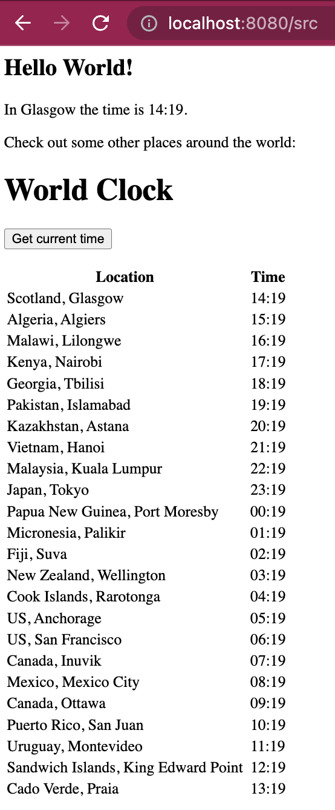

# This is a world clock. Wowza!

### note to future self 
learned this from:
- https://www.youtube.com/watch?v=G48m82q5nxQ&ab_channel=MBJourney 

### process
- start with empty folder and open it in VsCode
follow these steps in order:

### installations
- npm init
- npm install react react-dom
- npm install typescript -D
- tsc --init

### configure tsconfig.json
- in tsconfig.json uncomment the line that specifies what jsx code is generated (here line 16) and change it to "jsx": "react"
- uncomment "sourcemap": true, (here line 50)
- uncomment and change line 52 to "outDir": "./build-ts", 
- uncomment line 53 "removeComments": true,

### installations
- npm install webpack -D

### process
- create new file called webpack.config.js
- copy & paste the following into the webpack.config.js :

const path = require('path');

module.exports = {
    mode: 'development',
    entry: path.resolve(__dirname, 'src', 'index.tsx'),
    output: {
        path: path.resolve(__dirname, 'src'),
        publicPath: 'http://localhost:8080/src',
        filename: 'bundle.js'
    },
    module: {
        rules: [
            {
                test: /\.tsx?$/,
                exclude: /node_module/,
                loader: 'ts-loader'
            },
            {
                test: /\.(jpg|jpeg|gif|eot|otf|webp|mp4|webm|wav|mp3|m4a|aac|oga|ico|svg|woff|woff2|png|ttf)$/,
                use: [{
                    loader: 'file-loader'
                }]
            }
        ]
    }
}

### installations
- npm i ts-loader file-loader -D
- npm i html-webpack-plugin -D

### confid webpack.config.js
- add on the second line:
const HtmlWebpackPlugin = require('html-webpack-plugin');

- add a comma on line 26 after the curly bracket } and then add on the next line:
    plugins: [
        new HtmlWebpackPlugin({
            template: path.resolve(__dirname, 'src', 'index.html')
        })
    ]

### process
- create a src folder
- create index.html in src folder
- copy and paste the following into index.html:
<html>
    <head>
        <link rel="shortcut icon" href="favicon.png">
        <title>Typescript React APP</title>
    </head>
    <body>
        

        
    </body>
</html>

### process
- add a favicon.png (just any picture) to the src folder
- create index.tsx file in src folder

### install
- npm i @types/react @types/react-dom -D

### config
- in tsconfig.json make sure "esModuleInterop": true, is uncommented

### code
- in index.tsx add:
import React from 'react';
import ReactDOM from 'react-dom';

ReactDOM.render(
Hello World
, document.getElementById('root'))

### install
- npm i webpack-dev-server webpack-cli -D

### config
- in package.json add in scripts on the line underneath "tests":
"start": "webpack serve --open"

### run it
- npm start
- it will open in localhost:8080 but you need to go to
- http://localhost:8080/src

